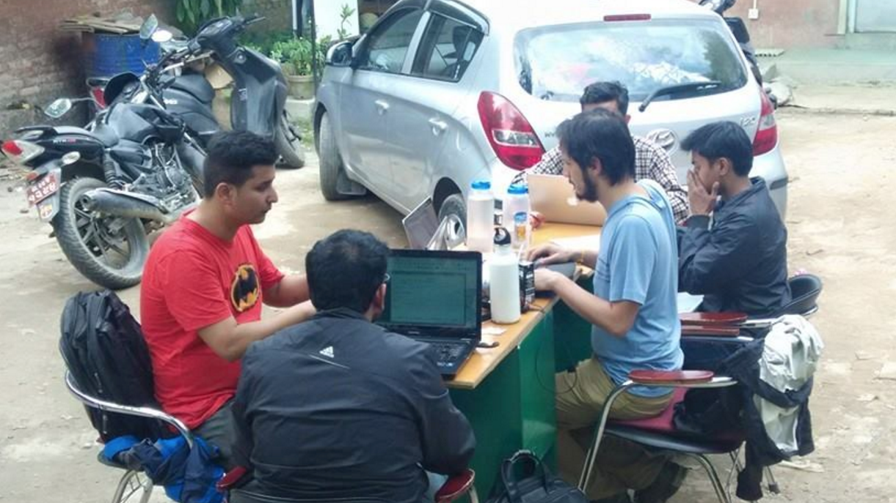
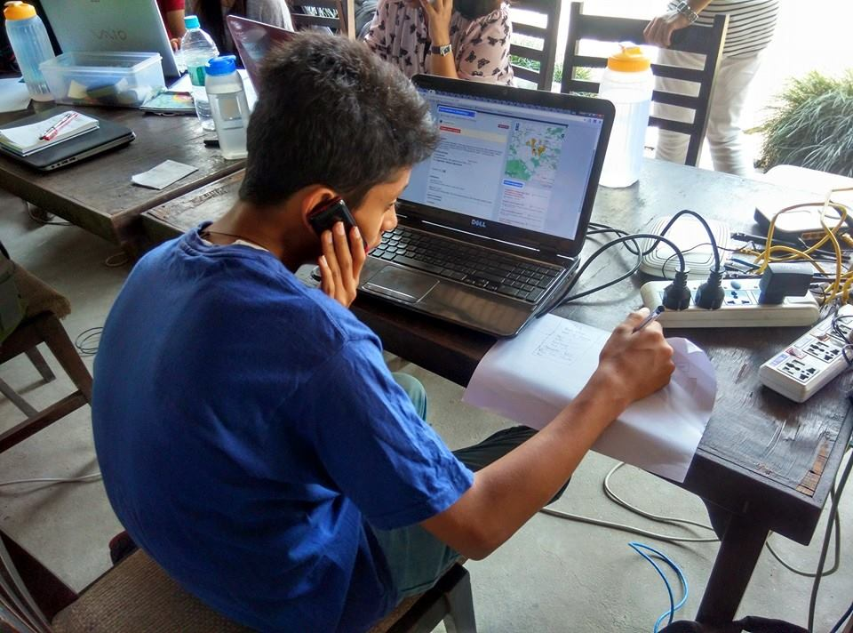

On April 25th, 2015, a massive 7.8M earthquake shocked Nepal. At the time, I was living in Kathmandu, and had been a part-time Design Fellow at Kathmandu Living Labs (KLL). I was lucky to survive largely unscathed, among heavy damages and casualties particularly in the countryside.

The day after, a significant aftershock awoke those of us who had managed to gain a few winks at 5am. At that point, I called KLL staff, who were already planning to mobilize--KLL was a civic technology company building open information systems, including for disaster preparedness. By 12pm, we had set up a "situation room" to help co-ordinate the Earthquake response the best we could. For the next three months, until I left Nepal, I worked day and night with KLL, helping set as well as implement the organization's response strategy.

*Situation Room Day 1: We moved out to the parking lot because we were still experiencing aftershocks. April 26th, 2015*

#### QuakeMap

One of the first things we did was deploy [QuakeMap.org](QuakeMap), a platform where we could aggregate *who* needed *what*, and *where*. From previous disasters, we knew that co-ordination of response becomes a significant issue very quickly, and we decided to address that issue proactively. Because the team had worked with many of these technologies before, we were able to deploy the tech very quickly, and were able to spend most of our creative energy working out meaningful workflows so that information about need was acted on.

Our focus with QuakeMap was on making sure that the information being gathered on the system was acted upon. To do this, we mobilized youth volunteers to verify information that was being put on the system, prioritize and triage the information, as well as try and find service providers that could help actually fulfil that need. All of this work was then documented on QuakeMap, so another organization trying to deliver services didn't have to co-ordinate extensively before acting.

*QuakeMap volunteers called to verify each piece of information about community need. We then found response teams that could deliver relief and connected them through.*

The QuakeMap system, in the end, was a powerful co-ordinating force in the haphazard earthquake response and relief systems. There were hundreds of citizens' volunteer groups that provided relief materials (everything from tarps, zinc tins for temporary shelters, food, medicine, and hygiene kits) who were able to have a central space of co-ordination. We also worked directly with the Nepal Army, who prioritized need areas documented in QuakeMap to extend relief teams into.

This work was later praised extensively, including by articles in the NYTimes, BBC, The Guardian, Wired, NPR, and in reports by the international humanitarian community (World Bank, IFRC, US State Department).

#### Co-ordinating  with the international mapping community

Another major aspect of our work was to co-ordinate with international mapping community. There was an enormous outpouring of volunteer energy to help us with mapping efforts throughout the country (using Satellite imagery). At KLL, our role was to guide the volunteer communities to make sure what they were mapping was useful to relief workers. In addition to directing mappers to the hardest hit areas, we also communicated with Satellite imagery providers at DigitalGlobe, providing them prioritized maps of where demand was high for Satellite imagery.

#### Mapping and GIS support

We also provided mapping and GIS support to many local organizations, who needed the support after the Earthquake. For UNESCO, we designed a system to crowdsource information about damage to cultural heritage throughout the country, extremely important given that some of the architecture dates from the 6th century. We created a map visualization of the casualties and damages that were sustained throughout Nepal for the Government's of Nepal main response agency. We created a distribution tracking mechanism for MercyCorps' extremely varied response efforts. We also provided printed and offline digital maps of OpenStreetMap data to agents who were going out with the field with maps "made in the 1950s" as told to me by a volunteer from Medicines Sans Frontieres.

### My Role
I had an active strategic and operational role in most of the projects listed on this page, and more, all of which took place in the three months after the Earthquake. I worked with the Executive Director to decide our response strategy, and then directly with the rest of the 10-person team to make it operational.

