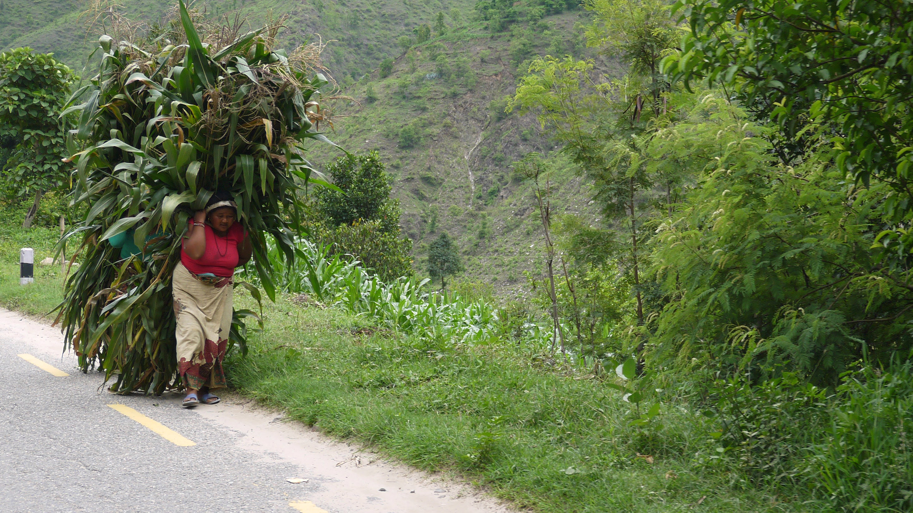
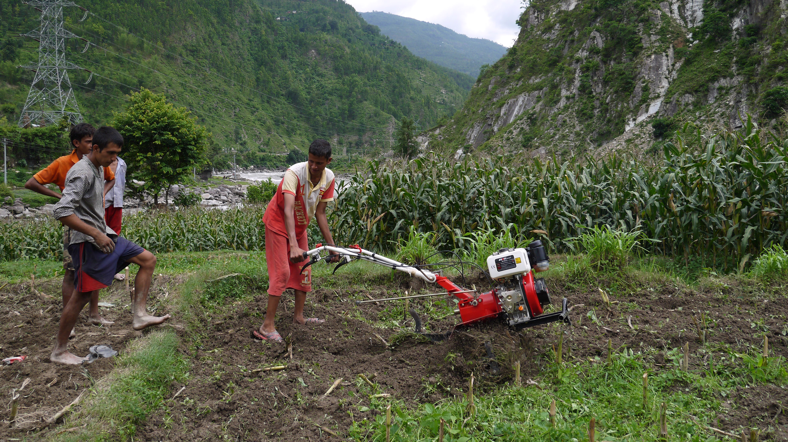
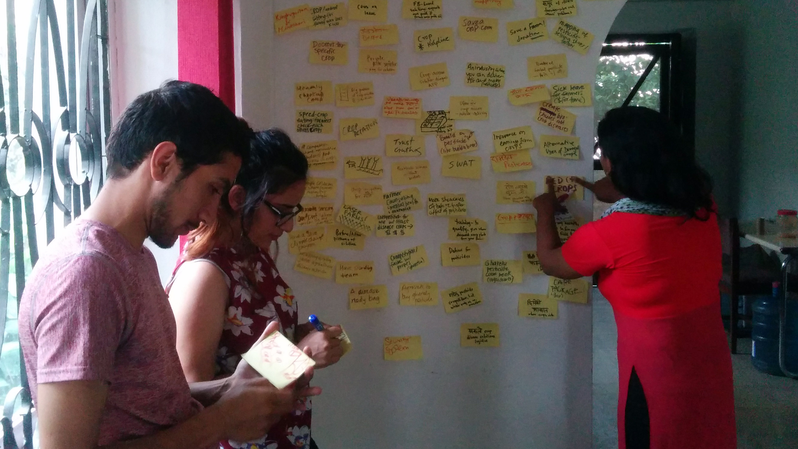

### The Context 
In the summer of 2016, I got grant funding from Stanford and UC Davis to go Nepal with an open-ended mission: _how might we improve the agricultural productivity of smallholder farmers in Nepal?_ Low agricultural productivity of small farms is a big problem in Nepal, effecting not only the economics of farming but also development goals such as nutrition [1]. Moreover, research shows low levels of investment in farm productivity, even when migration provides both a labor incentive (fewer farmhands) and economic ability (money sent back from abroad). [2] I worked with a local civic tech organization, trained a few of their members in design thinking, and worked closely with farmers to investigate this problem and see if anything could be done.

*Carrying heavy loads: a classic low-productivity activity in small farms.*

First, we spent time narrowing our scope of what kind of farmers our project should work with. We identified that:

 * As a whole, agriculture is seen as a "backwards" profession. Traditional agriculture, which has very low productivity, is on the decline and is seen as the last option for most people, something you do _"only if you aren't smart enough to get an education and get a normal job."_
 * Commercial agriculture, however, is emerging as a viable and profitable business for many. However, the stigma of being a "backwards farmer" makes it really hard to enter commercial farming--we even heard of marriages that ended over the decision.
 * Those who do enter commercial farming are interested in anything and everything that will make their farms more profitable. A successful farm is how they will show doubters that they were right to go into farming in the first place. As a result, we saw people experimenting with new techniques and technologies in many small commercial farms.

*Some farmers are boldly choosing agriculture over jobs in the city. They experiment with new tools and technology, like the roto-tiller pictured.*

In addition to identifying large-scale trends and underlying motivations, we also explored how farmers choose what to farm, and learn about new practices.

 * For farmers, seeing is learning. After first-hand experience, they trust seeing other farmers' fields and experiences. In one farmer's words: _"I went to a 7-day training on vegetable farming. Then on the last day, we visited a mushroom farm. I then came back and immediately implemented mushroom farming on my plot as well. I'm glad we got to see that farm."_
 * For farmers, information is social. As editors of a magazine for farming put it, _"we realized very quickly that farmers want to talk to people. In all of our articles now, we include a phone number for everyone who is cited in the article."_
 * In adopting new techniques and technology, the rate of failure is high. Yet, there are not a lot of ways to share hard-earned lessons. A farmer who we contacted because we heard about his successful experiences with mulching told us: _"that was my second experience with mulching. The first time, I got the wrong kind of plastic. On my third try, I put down the plastic when the ground was wet, and my crop just didn't grow."_

*Synthesizing information and brainstorming with the team at KLL.*

After discovering all of this, we decided to prototype a video-based cross-learning platform for farmers. We prototyped a video (in two short iterations) focused specifically on a farmer's experience trying mulching. After showing him failing and then succeeding, we introduced some how-to information about mulching.

<iframe width="740" height="460" src="http://www.youtube.com/embed/huvFL9uYYeI?rel=0&cc_load_policy=1" frameborder="0"></iframe>

*Prototype video that combined a farmer's experience with how-to information. The fast and cheap prototype was made by screencasting a powerpoint presentation.*

In early tests, this prototype had positive reactions. The visual detail in the video was strong enough that most viewers could recall the how-to information presented. The farmer's story made the information about plastic mulching believable, and some farmers we showed the video to even asked for his phone number. The main improvement comments were about production quality and language use, which we knew had severe limitations given this was a fast prototype.

A team, including the non-profit and researchers I had worked with at UC Davis, are continuing to work on the project, and seeking further funds to continue the project. We also found a team in India, called [Digital Green](http://digitalgreen.org/), who had been doing video-based trainings very successfully among farmers there, which further sought to validate our summer findings and proposed work.
