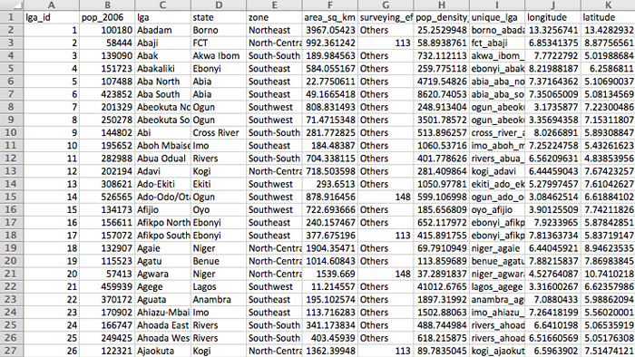
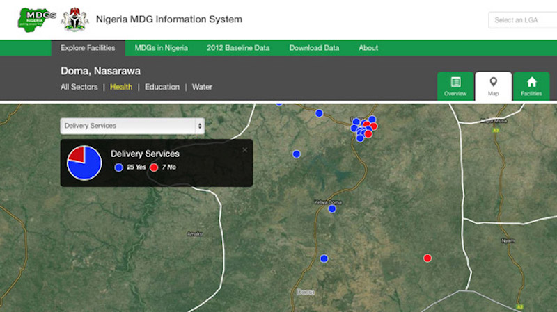
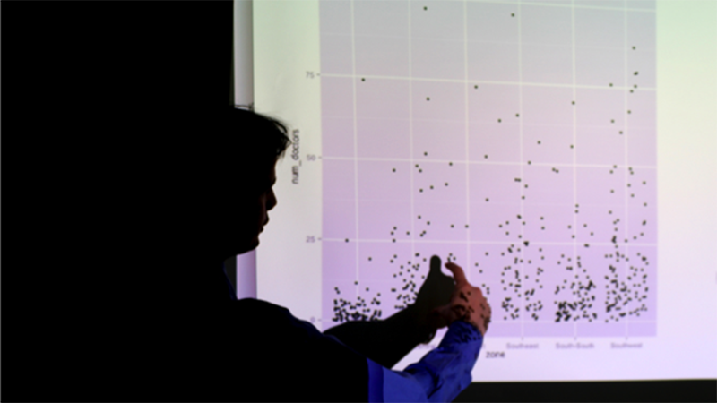

In 2005, the Nigerian federal government's OSSAP-MDGs (Office of the Senior Special Assistant to the President on the Millennium Development Goals) created the Conditional Grants Scheme (CGS) as a way to channel $1.2 billion USD into local infrastructure development projects. Through this scheme, funds are released to Local Government Areas (LGAs) to be used for specific, approved purposes geared towards reducing poverty and improving education and public health.

In order to facilitate local development at scale like this, OSSAP-MDGs partnered with Columbia University to collect rigorous data about the existing state of social infrastucture throughout Nigeria, and create a data-driven local planning process. The data, collected in batches from 2009 to 2013, created a geo-referenced inventory of facility-level data for the nation's health, education, and public water facilities. The data was then used to inform local, state, and federal interventions so that gaps in access to social services could be lowered, helping Nigeria achieve the MDGs.

Our team at Columbia University's Sustainable Engineering Lab created digital systems to enable all of this data collection (all of which was collected on smartphones), as well as the information systems that allowed this data to enable planning for new infrastucture development.

*The homepage of NMIS, which was designed by our team.*

One of the things we thought a lot about was how the trove of data we were helping collect could inform local planners, whose training was in social development (such as water management, or public works) rather than computer systems or data analysis.  To illustrate just how difficult it would be for someone to interpret this data themselves, here is an example of what raw data from a survey might look like.

*A sample of raw survey data from the baseline inventory.*

To our users, this kind of data was virtually useless, and irrelevant to their actual goals of creating better social infrastructure. As the software and data team, our job was to turn this overwhelming raw data into maps and informational displays which were much more actionable to the planners. To do so, we worked closely with health and education experts at Columbia and created indicators that would be much meaningful for development in each invidual sector instead.

*A map of whether health facilities in Doma LGA offer delivery services.*

Although creating the data systems to transfrom the data in this way was difficult and tedious work, we realized it was all worth it when we heard from some of our local planners:

> *When I was hired, I was new to this LGA. I spent my first month getting acquainted with the area; the local community showed me the schools and clinics, and we had a lot of community meetings.... I was looking at NMIS, later, and I realized that in the very outskirts of the LGA, we had some health facilities that were not doing very well. The local community hadn't told me about that area because it was hard to travel there--they didn't want to inconvenience me. But those are exactly the facilities that we need to be helping develop further!*

### My Role

I was the Systems Designer and Technical Project Manager, in charge of working with the Nigerian government to understand their needs, conceptually design the software systems to best meet those needs, and make sure that what we designed got built on-time and shipped in a way that solved the on-the-ground needs of our counterparts. In my three years with the project, I did everything from attend high-level government meetings, test our data collection surveys under the hot Nigerian sun, write software, write questionnaires, learn R in order to analyze large amounts of data, lead a software team of 8 people, train staff in Nigeria to use our work, write year-end reports, and interview local-level planning staff about how our systems helped them do their jobs better.

*Ultimately, we trained our Nigerian counterparts to maintain the sofware systems we had built. A picture from one of the trainings.*

When I think of my largest contributions to the team, I feel most proud of (1) making sure that we were solving real needs with the data systems we built; (2) ensuring our systems were built in such a way that we could ultimately hand them over to our Nigerian colleagues; and (3) introducing a data-driven approach to our own team [^1].

[^1]: Until I got there, our team was building data _pass-through_ systems: we would help collect the data, and display it for other people (local planners) to analyze. This was well and good, but I thought that we should also analyze the data ourselves, holistically, to see if we could learn anything interesting. Given this was a new proposal, I decided to kickstart the effort: I learned R in the evenings, and started to create analyses comparing different regions in Nigeria to each other. This kind of analysis yielded insights that were interesting enough that we hired data scientists into the team, and eventually advised the Nigerian government to take on a second "clean-up" data collection effort. By looking at the data carefully, we were able to figure out places where the data coverage was low, and where we had to send back enumerators to collect data from the local level again.

