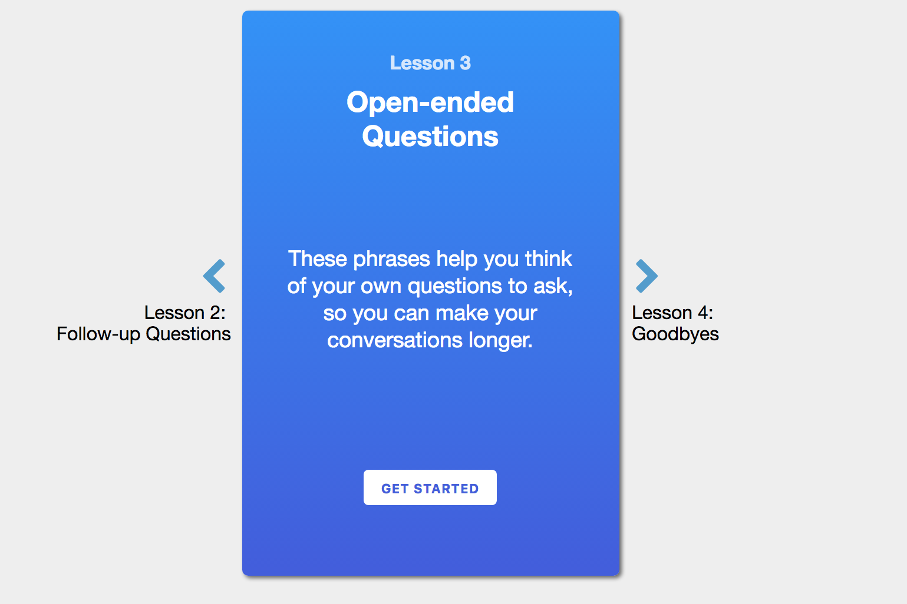

### The Context

Practica is an English language coaching service focused on helping users gain spoken fluency. A learner got paired with a coach, who sent them daily practice activities over SMS and WhatsApp. The users then reported back to the coach to get feedback and suggestions for improvement. Initially, all Practica activities involved going out and talking to people in the real world, but users were often too hesitant to do this. Additionally, even though practica helps people improve, learning new content is what makes users _feel_ like they are learning. 

Practica needed a content-delivery platform that prioritized real-like spoken skills, including listening and speaking.

### My Role

I co-founded Practica with two other graduate students while I was studying at Stanford, and realized this additional need as we were delivering the Practica service. I was the primary designer and the only software developer on the Practica Audio Card Platform. My co-founders were the primary curriculum / content developers. 

### The Product

The Practica audio card platform offers beginner and intermediate English learners a methodical way of listening to conversational English and allows them to practice speaking as well. After hearing from and observing many language learners, we have create two modes for listening: first without presenting any text and a review that does present the text.

### Tech Stack

  * React.js and a serverless back-end
  * `gentle` is a forced aligner we use for data processing and audio alignment, which allows us to precisely control audio playback without manually having to align audio and text to each other.

### The Learning Stack

For learning how to improve Practica Audio, we use the following techniques:
  
  * fullstory.js -- We make extensive use of fullstory.js to track user behavior. We watch where our users pause for a long time (often because of confusion), and keep track of how and whether they go through our intended user flow. 
  
  * User observation -- we ask our users to use the app either in front of us or on Skype as we are listening. We then compare how we see our users use the app live to how we see them use the app on FullStory to draw insights.
  
### The Impact

We just launched the Practica Audio Cards platform in a private beta. In the first week of launch, despite only having 90 seconds of audio content on the platform, our users used the app for an average of one hour each over an average of 4 visits. 

### Personal Learnings

 * React is awesome :) Besides that, I am looking forward to learn a lot more from the project once it gets a few more cycles of use.