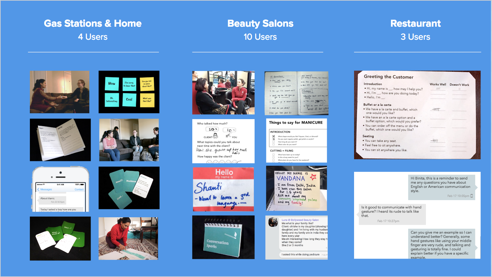
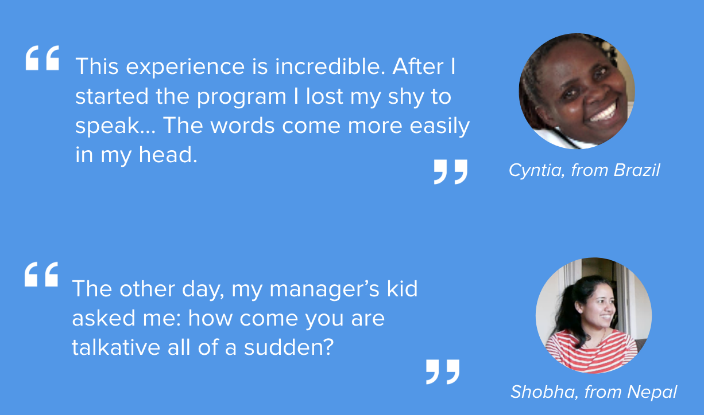
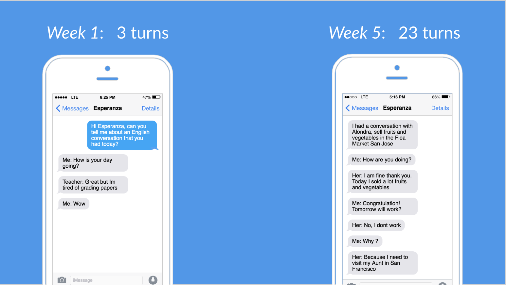

### Context

There are 23 million adults in the US with limited English proficiency. Limited English impacts everything: employment opportunities, ability to support children’s education, and connections and friendships outside your home country community. The numbers around employment are staggering: for college-educated immigrants, there is a 30% income gap driven by _spoken English alone_, and $39 Billion in annual lost wages due to the under-employment of college-educated immigrants. 

Unfortunately, today’s “solutions”--largely classroom-based English learning--are not working. Not only do these classes require being in a physical place at a specific time and place (which has high co-ordination costs), they also prioritize academic ("book English") instead of practical English, and the one-teacher-many-learners setting doesn't provide adequate interaction for learners.

### Key Insight

After interviewing several dozen immigrants in the US, we realized two key things:

 * There were many people who felt 'stuck' at a low level of English. Initially, they had come in with the assumption that they would learn English "just by being in the US", yet, even after 7 years, 10 years, and yet, they felt their English hadn't improved at all. A major theme that came out here was _being afraid to talk to native speakers_.
 
 
  
 * On the flipside, those who _had_ succeeded in improving their language drastically had often hacked the real world to get lots and lots of practice.

Practice makes perfect, but practice is harder than it looks. This led to our unique approach to English improvement learning:

> How might we help immigrants increase the frequency of everyday interactions, so they can become more _confident_ English speakers?

We decided to work specifically with immigrants working in the service industry, who need to interact with English-speaking customers for their jobs. We also hypothesized that by giving people more confidence interacting with people, we would create value for the employers, who want employers with better communications skills.

### Prototyping

Following the principles of  methodology, we sought to design a low-fidelity prototype that would meet our fundamental objective: helping learners increase the frequency of everyday conversations. 

We started an informal home-based learning environment to try out different experience prototypes, and created 18 different low-fidelity prototypes using paper and hand-written SMS messages, and tested these with 17 different users. We refined prototypes that were working, and discarded ones without resonance from our users.

### The Product

Based on our prototyping, we found that a semi-automated language coach was an amazing way to help people increase their practice frequency. By using automation, we could send people daily messages of real-life practice activities. A coach could then schedule an SMS-based check in with each learner, and provide them live feedback on their practice.

Such a hybrid system leverages the human relationship to help the learner stay motivated and accountable, and the technology assists the coach in the process of supporting a large number of users.

### Impact

We piloted this program over 5 weeks with 35 people, who gave us amazing feedback.

Our we had **75% Daily Engagement** and only **33% drop-off** over 5 weeks, which is better than the drop-off and engagement rates for products that have been in use and operation for multiple years. For an example, the adult ESL drop-out rate can be as high as **60%** [over a year](http://www.lexingtoninstitute.org/wp-content/uploads/2013/11/AdultELLpaperJuly13.pdf).

We also tracked data, including the number of "conversation turns" (one turn is one person talking) our learners reported in their SMS messages over time. For some learners, like Esperanza from Mexico, the number of conversation turns increased by 8x.

### Future Work

We are working to find business model that will allow Practica to scale, particularly via employers who want their employees to have better customer service skills. If you know someone who would like to work with us, drop us a line at projectfluency _AT_ gmail _DOT_ com.

