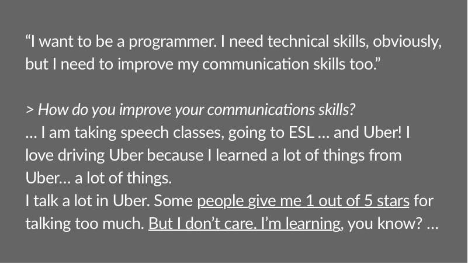

We [^1] started Project Fluency by simply talking to legal immigrants in Northern California working in low-wage jobs. We quickly realized the huge scope of under-employment in the migrant community: people who were journalists, teachers, and managers in their home countries working as gas station cashiers, babysitters, and in beauty salons here. Among the myriad contributors to under-employment, we decided to tackle an ab that many immigrants themselves limited by: their "English". We found "English" was actually a stand-in for a host of problems about how to navigate America: a _cultural fluency_ that is hard to acquire for late entrants. Underlying the things that help you build _cultural fluency_, like relationships, and immersion, we found communication to be a problem that needed another look.

The current "solution" to teaching immigrants communication skills are English as a Second Language (ESL) classes. However, the class structure of ESL causes a host of problems for immigrants in "survival jobs", the primary one being that it requires a significant investment (transportation, a fixed time on weekly schedule which may mean lost hours and in some cases lost jobs, choosing to go to classes instead of working). On the other hand, we observed that some immigrants have quite innovatively turned their jobs into learning grounds for English.

*A bright spot: Byas Dhungana uses Uber as a learning ground.*

In fact, the service industry, which most immigrants work in, serves as a promising potential communications learning environment. Customers from the host culture are abundant, and in fact, conversation is a part of the service expectation in many cases. Given this opportunity space, in this project, we are asking:

> How might we convert service jobs for immigrants into an opportunity for learning about the host culture?

*How might a nail salon also act as a ground for learning English?*

We are currently learning rapidly by prototyping several different approaches to solving this problem. If you have an idea, drop us a line!

[^1]: Project Fluency is a project by Prabhas Pokharel, Teagan Daly, Maya Sussman, and Natasha Malpani, and was originally a thesis project for the [Design Program](http://designimpact.stanford.edu/) at Stanford University.

