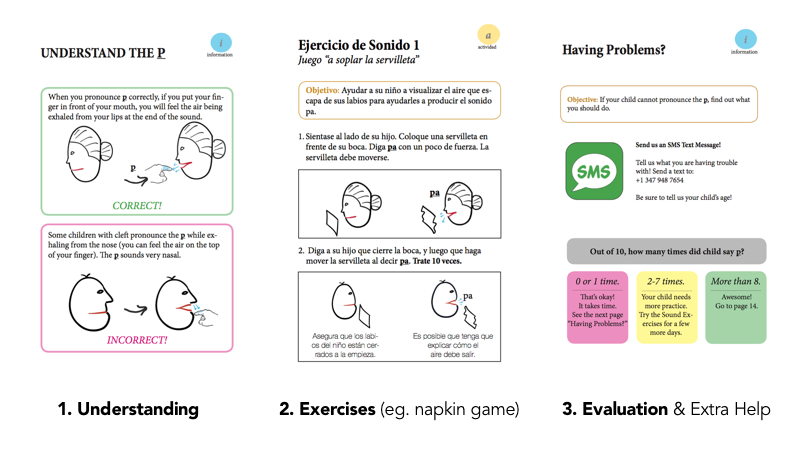
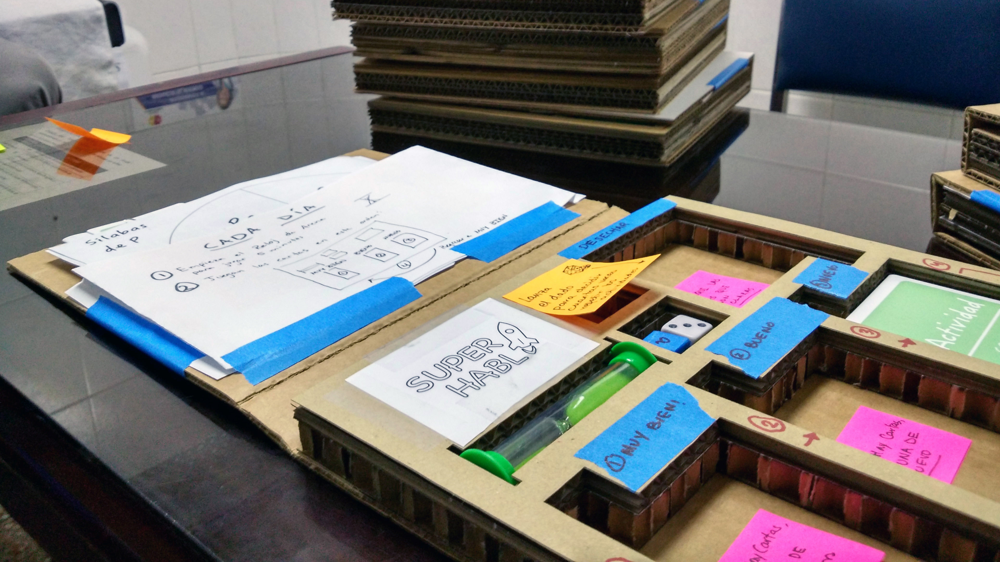
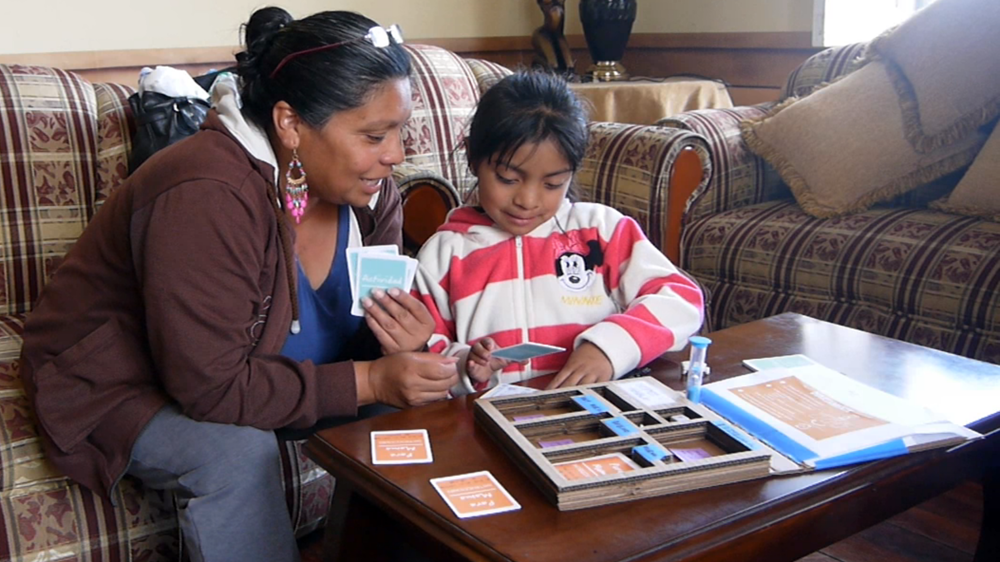
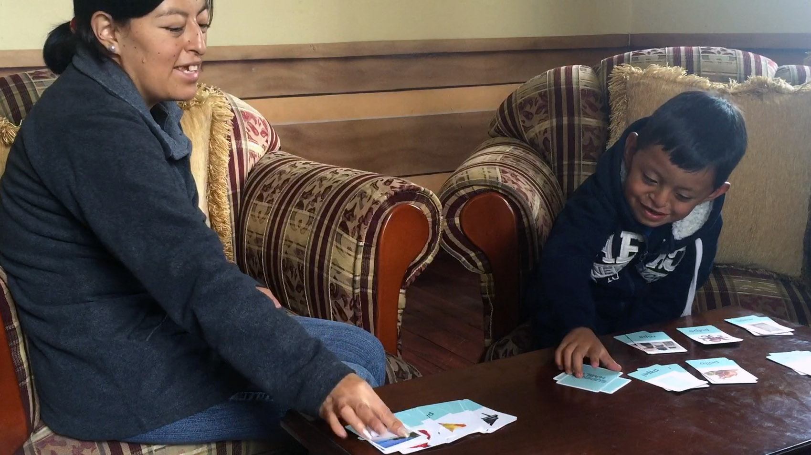

> “How Might We help cleft palate patients in Ecuador recover their speech after surgery, given that there are only 2 cleft-trained speech therapists in the country?”

*Interviewing a family at their home in JipiJapa, Ecuador. They used to travel four hours to get to a speech therapist, but had to stop after a second child.*

In 2016, we took on this challenge as a part of Stanford d.school’s Design for Extreme Affordability class.  After working closely with Fundacion Rostros Felices, an organization providing surgery and some speech care to patients in Ecuador, we identified three challenges for speech therapy in this context:

### Access
 *“[the cleft-trained speech therapist] lives four hours away. I took my child to her three times, but when I had my second child, it was too difficult to keep going.”*
### Effectiveness
*“I have tried three speech therapists locally who have worked with my child. With this latest one, he co-operates, but he hasn’t made much progress yet.”*
### Engagement
*“Pablo, pleeeeeeease…. If you do this therapy, we will go get ice cream. Do you want ice cream? Please… there is just a little bit left.”*

Many parents simply didn't have access to effective cleft-trained speech therapists. Even if they did, however, the repetitiveness of speech therapy is extremely boring for kids. More than half of the speech therapists' job was often to simply get the kids to "collaborar" (co-operate).

Our interviews also showed us that smartphones were not widespread in the community we were working with, but literacy was extremely high in Ecuador (97%). After testing many prototypes with analogous users in the US, the first prototype we took to our patients was a booklet, which aimed to (1) provide moms with information about cleft-specific speech therapy, (2) provide some guides to evaluate their children’s speech and (3) contained fun exercises for the kids.

*Sample pages from the booklet for the p sound.*

Early tests had seemed promising: one mom told us that her kid who didn't do therapy at home finally started to play the napkin game included in the book. Kids were enjoying some other activities (including a roulette) as well. However, after interviewing parents, we realized that while some of the activities were fun, the book format echoed homework. Visual information was helpful to the parents, but they ignored most of the sections that required reading, including the bits on evaluation. As one mom put it, “its not that we can’t read—we can, we just don’t like to.” Based on this feedback, we decided to create a behavioral mechanism that would ensure daily usage of the most popular and useful part of the book: the activities. So we packaged activity cards into a boardgame-inspired layout, and took it down to Ecuador for another test.

*Our boardgames, waiting, as patients finished post-surgical screening next-door.*

User testing with this game gave us much more positive results. The kids loved the new game and its activities, and the colorful materials, and the game-like look of the setup. But we had a lot of activities, some of which still involved reading, and some activities were definitely more fun than others. The amount of imaginative play that kids participated in also varied between the US and Ecuador, and some game features that were a hit in the US (like a “SuperHero” card) totally fell flat in Ecuador.

*Mom and patient testing out our board game.*

Another thing we noticed was that despite starting quite well, the dynamic between kid and parent often worsened after a while. For most of the activities, there was a “success” criterion, whose judge was the parent. However, this created a dynamic where instead of being in a support role, the parent became an evaluator of the kid. The kid’s challenge for that day was literally meeting the parent’s standards for an activity. Driven by the desire for their kids to achieve better speech, parents would often want their kids to practice even when the kids no longer found the activity fun or engaging.

*The smiles last a lot longer in initial tests with our latest prototype.*

In our third design cycle, we wanted to create the right interpersonal dynamic between child and parent. We focused on how we might break down the large and complicated journey to “better speech” to a small daily goal, in which the parent is cast as a support (not evaluation) role. Based off of this design direction, we have designed two games that are currently being tested by patients in Ecuador. After a good initial response, we are testing to see if patients will continue to use these games over a couple of months.

### Top Learnings from the Project:
 * The power of pivoting. This project allowed me to experience the full spectrum of emotions when you pivot. We put serious amount of work into each final prototype that we took to Ecuador, and recognizing their flaws felt painful at first. However, with each new cycle, it is pretty easy to see how much more relevant our solutions are to our end users.
 * I now understand very viscerally that the most powerful part of the design thinking process is actually iteration. The end of the “empathy” phase of the process creates a good hunch about the solution space, but it’s a hunch nevertheless. The real test comes when you put designs in front of users.
 * Ethnographic research is about a lot more that interviews and observation. Particularly when it comes to cross-cultural research, a lot of the learnings come from being attuned to taking in everything—outside of interviews and intercepts. Keeping a constantly curious mind, talking to partners incessantly, and being hyper-aware of the interactions around you can open up new avenues of investigation that you didn’t know were possible.

