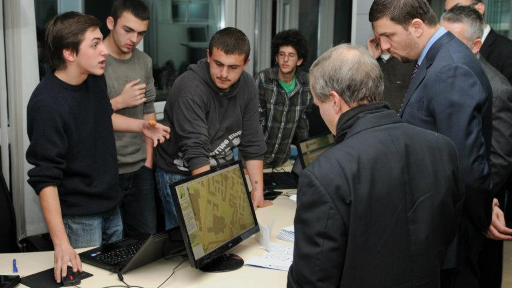

UNICEF Kosovo invited me to establish technology programs that furthered the organization’s strategic interests. I designed the [UNICEF Innovations Lab Kosovo](http://kosovoinnovations.org/)—everything from layout to activities —taking inspiration from the open innovation ethos of participatory design and innovations spaces such as iHub in Kenya. I managed the Lab during its first 5 months.

*High schoolers present a bus mapping project to the Minister of Youth.*

The Lab's main component was "By Youth For Youth" projects, which supported young Kosovars to create and implement social change projects for other Kosovars. The Innovations Lab provided support to groups of young people, some of whom had no real-world experience before, to write proposals, manage budgets, and implement their programs. The Lab also provided visibility to promising projects, connecting some projects to governements.

*Young Kosovars designing an environmental campaign, 2016.*

The Lab continues to thrive. Since Jan 2011, the "By Youth For Youth" program itself supported 79 projects, involving more than 61,000 youth. However, more programs, like the UP Shift Social Venture creation competition have scaled the impact of the Innovations Lab even further within Kosovo.